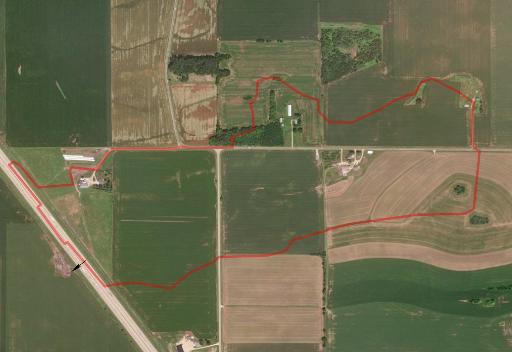

# Fundamentals of Culvert Design Using HY-8

_An introduction to culvert hydraulics, flow types, and design fundamentals with HY-8 examples._

---

## 👤 About the Author
- [Website](https://mohsentahmasebi.com)
- [LinkedIn](https://linkedin.com/in/mohsentahmasebinasab)
- [YouTube](https://www.youtube.com/@mohsentahmasebinasab)

---

## 📚 Table of Contents
- [Learning Objectives](#learning-objectives)
- [Introduction to Culverts](#introduction-to-culverts)
- [Culvert Design Criteria](#culvert-design-criteria)
- [Aquatic Organism Passage (AOP)](#aquatic-organism-passage-aop)
- [Flow Controls: Inlet vs Outlet](#flow-controls-inlet-vs-outlet)
- [Maintenance and Real-World Issues](#maintenance-and-real-world-issues)
- [HY-8 Software and Demo](#hy-8-software-and-demo)
- [Ecological Culvert Design (Bonus)](#ecological-culvert-design-bonus)
- [References](#references)

---

## 📚 Learning Objectives

- Understand how culverts convey flow and cause headwater buildup.
- Differentiate inlet vs. outlet control and their flow behaviors.
- Recognize the impact of headwater and tailwater on culvert design.
- Appreciate the role of maintenance (debris, sediment) in culvert performance.
- Get introduced to FHWA design guidelines and HY-8 software for culvert analysis.

---

## 🚀 Introduction to Culverts
- A culvert is a buried conduit designed to hydraulically convey surface water runoff or streamflow beneath a highway, roadway, railroad, or other embankment. Typically composed of structural materials around their full perimeter, culverts may also include bottomless designs. 
- They are distinguished from bridges unless their opening width is **10 feet or greater** along the roadway centerline. Regardless of structure type, culverts are analyzed using hydraulic design principles to ensure they safely manage flow without disrupting transportation routes.

  

Culvert collapses can cause major safety hazards, disrupt transportation, damage ecosystems, and require costly emergency repairs. Many road washouts during storms are directly linked to culvert blockages, under-sizing, or structural failure.

## 🎥 Culvert Failure to Watch"

- **"Culvert Failure - Road Washout "** (YouTube):  
  [Watch Here](https://youtube.com/shorts/J7mJAjFQG8Y?si=I3MZugXmWgXUVPAu)  
  *Real footage of road collapsing due to culvert failures during floods.*

## 📋 Culvert Design Criteria

> *Goal:* understand **what** each criterion means and **why** it matters for flow.  

| Criterion | What It Really Means | Simple Example of Its Impact on Flow |
|-----------|---------------------|--------------------------------------|
| **Design Frequency** | The size of storm (recurrence interval) a culvert is expected to handle without the road flooding—e.g., a “25-year storm.” | If you design for only a 10-year storm but a 25-year storm arrives, the culvert may be undersized and water could back up over the road. Designing for a rarer (bigger) storm means a larger (more expensive) culvert but less chance of overtopping. |
| **Allowable Headwater (HW)** | How high water is allowed to pond upstream of the culvert during the design storm. HW supplies the energy (pressure) to push flow through. | Raise the road, and you can tolerate a deeper pond (higher HW); the same culvert then passes more flow. Lower HW limits force you to pick a larger culvert so water doesn’t back up as much. |
| **Tailwater (TW)** | The water depth just downstream of the culvert. TW can act like “back-pressure” on the barrel. | If a culvert outlets into a deep river pool (high TW), the pipe may run full and switch to **outlet control**, needing more headwater to pass the same flow. With low TW (free outfall) the pipe can run partly full and often needs **less** headwater. |
| **Upstream Storage** | Any temporary ponding area upstream that can store runoff and reduce peak flow through the culvert. | A farm field depresses behind the road; by *allowing* some storage, you might keep the culvert smaller. But longer ponding could harm crops or the embankment. |
| **Outlet Velocity** | How fast water shoots out of the culvert. Velocities that are too high can erode the channel. | A steep, smooth pipe may discharge at 12 ft/s and scour the ditch. Adding a rougher material or flared outlet slows water, or you install riprap to absorb the energy. |
| **Minimum Size** | A practical lower limit so debris, ice, or sediment won’t clog the pipe. | A 6-inch pipe under a driveway will fill with leaves every fall; a 15-inch pipe is less likely to block and easier to flush. |
| **Shape / Configuration** | Choosing between circular, box, or arch barrels, and whether to use one or several. Shape affects capacity, cover requirements, and habitat. | A *box* culvert gives more width for shallow flows and fish passage, but a *round* pipe of the same area usually costs less. Multiple smaller pipes may carry less flow than one large box because debris can settle between them. |
| **Material & Roughness** | Pipe material (concrete, corrugated steel, plastic) sets structural life **and** hydraulic roughness (Manning’s *n*). Rougher pipes need more HW for the same flow. | Swap a smooth HDPE pipe (low *n*) for corrugated metal (higher *n*): flow capacity drops, headwater rises, or you must upsize the metal pipe. |
| **End Sections / Inlets** | The entrance shape—square, beveled, flared—controls how easily water gets in. | A beveled/​flared inlet acts like a funnel: for the same headwater it passes more flow than a sharp-edged pipe. Great when inlet control governs. |
| **Outlet Protection** | Measures (riprap, stilling basins) that prevent scour where water exits. | Without protection, a culvert that empties onto bare sand forms a plunge pool and undermines its own outlet. Add riprap: the rock breaks the jet and protects the bank. |
| **Site Factors (Alignment, Debris, Ice)** | Placement in plan/profile, cover depth, and local debris/ice conditions. | If you skew the culvert across the channel, flow makes a bend, drops sediment, and capacity falls over time. Aligning with the natural channel keeps flow smooth and reduces clogging. Adding a trash rack upstream stops big logs but needs maintenance. |

### How These Criteria Interact

* **Headwater, tailwater, shape, and roughness** together decide whether the culvert runs under **inlet control** (entrance is the bottleneck) or **outlet control** (barrel + tailwater are the bottleneck).  
* **Design frequency** and **allowable HW** set the target flow you must convey—changing either forces a change in size or number of barrels.  
* **Outlet velocity** and **site erosion potential** influence whether you add energy dissipation.  
* **Debris / ice potential** can override hydraulic efficiency—sometimes you upsize or add relief openings just so the system stays open.

## 🐟 Aquatic Organism Passage (AOP)

**Goal:** Ensure fish and aquatic life can move freely through the culvert, maintaining natural stream conditions.

**Key Design Practices:**
- **Match culvert slope** to the natural stream slope.
- **Align** the culvert with the stream channel (no sharp angles).
- **Size the width** to be at least the **bankfull width** of the stream.
- **Maintain flow depth and velocity** similar to the natural channel.
- **Provide a continuous sediment bed** inside the culvert (gravel, cobble).
- **Allow sediment and debris transport** through the culvert.
- **Embed the culvert** below the streambed if possible (for natural bottom).

## 🚦 Flow Controls: Inlet vs Outlet

At any discharge a culvert is limited by **one** of two possible control points:

| Control type | What limits the flow? | Typical barrel condition | Key variables |
|--------------|----------------------|--------------------------|---------------|
| **Inlet control** | The entrance opening behaves as a weir/orifice and chokes the flow **before** it can fill the barrel. | Barrel runs super-critical and usually *part-full*. | inlet area & shape, edge geometry, headwater depth |
| **Outlet control** | The downstream water level or barrel losses consume the available head; the barrel can’t pass what the inlet could supply. | Barrel runs sub-critical and often *full*. | tailwater elevation, barrel length/slope/roughness, entrance & exit losses |

### Understanding Inlet and Outlet Control (Simple Examples)

**Inlet Control:**  
- Imagine trying to pour water into a small funnel.  
- The size of the funnel opening limits how much water can get through — **even if the pipe underneath is huge**.
- It doesn’t matter how long or rough the pipe is; **the entrance itself** controls the flow.  
- ➔ *Inlet control = the opening is the bottleneck.*  
- **Real-world feel:** Small door on a big hallway. No matter how wide the hall, you can only get in as fast as the door lets you.

**Outlet Control:**  
- Now imagine water flowing through a long, rough garden hose.  
- The water easily gets into the hose, but the hose is so long and rough that **friction slows it down**.  
- Plus, if the hose is pointed into a bucket already full of water, the bucket’s water level **pushes back** and makes it harder for water to escape.
- ➔ *Outlet control = the whole journey (hose friction + exit conditions) limits the flow.*
- **Real-world feel:** Running on a treadmill with strong wind blowing against you — it’s not just starting that’s hard, it’s the whole trip!

### 📝 Quick Takeaway:
- **Inlet control:** entrance matters most.  
- **Outlet control:** barrel, roughness, tailwater, and friction matter most.

### Illustrative Scenarios

| Scenario | What you’d see | Why it behaves this way |
|----------|---------------|-------------------------|
| **Inlet-control example** | Shallow tailwater + steep pipe. Water shoots out freely; only the inlet submerges. Barrel is part-full. | Head loss is dominated by the entrance; barrel offers little resistance. |
| **Outlet-control example** | High tailwater or a long, corrugated pipe. Upstream pool rises until the barrel flows full or even backs up. | Energy is lost in friction & exit losses; downstream water “pushes back.” |

  

  👉 [Click to watch: *Understanding Inlet and Outlet Control in Culverts (Short FHWA Summary)*](https://youtu.be/lbElfCcSknU?si=zLASZHqNI9iKuRhx)

## 🛠️ Maintenance and Real-World Issues

* **Design ≠ Done.** Culverts must be inspected and cleaned; debris, sediment—or even beaver dams—can halve the effective opening or block it entirely.  
* **Analogy:** A leaf-stuffed funnel: pour water in and it backs up, then spills everywhere. A culvert inlet clogged with sticks does the same—water ponds and can overtop the road.  
* **Real case (Oregon, Jan 2012):** Storm-driven mud blocked highway culverts, eroded the shoulder, and flooded the roadway. Field studies show small culverts (< 6 m span) are most likely to plug during major storms, leading to washouts.  
* **Design & O&M takeaway:**  
  * Include a debris allowance or trash rack where clogging is likely.  
  * Plan regular inspections, especially after big storms.  

  

  <em>Source: <a href="https://www.mdpi.com/2076-3417/11/16/7561" target="_blank">MDPI - Applied Sciences Journal</a></em>

## 💻 HY-8 Software and Demo

* **What it is:** Free FHWA program that automates the inlet-control / outlet-control checks you just learned.  
* **Why it matters:** Pre-computer era = nomographs + trial-and-error; HY-8 now runs the equations instantly, tests multiple pipes, and plots performance curves.  
* **Demo outline:** enter site data → pick pipe size/shape → view headwater, outlet velocity, and roadway overtopping results → tweak and re-run.

### 🎥 HY-8 Demo Video

Watch a short tutorial where I walk you through modeling a culvert in HY-8 and interpreting its hydraulic behavior.

_(Video coming soon — placeholder here)_

### Classroom Problem: Culvert Performance Analysis

A local township has reported frequent roadway overtopping during large storms at a culvert crossing.  
You have been asked to analyze the existing culvert using HY-8 and propose recommendations if needed.

**Your Tasks:**
1. **Model the culvert** in HY-8 using the given data (survey data and hydrologu data provided).
2. **Determine if the existing culvert is inlet-controlled or outlet-controlled** at the design flow.
3. **Evaluate the headwater elevation** at design flow.  
   - Is the headwater within acceptable limits compared to the roadway crest elevation?
4. **If the culvert performance is inadequate**, suggest two design improvements based on hydraulic behavior.
> **Hint:** Remember to check the culvert performance curves and roadway overtopping report in HY-8 after running your simulation!

### 🌎 Site Overview

  

  <em>Note: Watershed boundaries are outlined in red, and the culvert location is marked with a black arrow.</em>

### HY-8 Demo Inputs Summary

#### 📊 Discharge Data
- **Discharge Method:** Minimum, Design, and Maximum
- **Minimum Flow:** 184.310 cfs
- **Design Flow:** 243.760 cfs
- **Maximum Flow:** 312.380 cfs

#### 🌊 Tailwater Data
- **Channel Type:** Irregular Channel
- **Channel Slope:** 0.0100 ft/ft
- **Cross Sections:** provided in the "Demo Data" folder: [Download Cross-Section Data (XS_Data.csv)](Demo%20Data/XS_Data.csv)

#### 🛣️ Roadway Data
- **Roadway Profile Shape:** Constant Roadway Elevation
- **First Roadway Station:** 0.000 ft
- **Crest Length:** 90.000 ft
- **Crest Elevation:** 1025.160 ft
- **Roadway Surface:** Paved
- **Top Width:** 134.580 ft

#### 🕳️ Culvert Data
- **Name:** Existing Culvert
- **Shape:** Circular
- **Material:** Concrete
- **Diameter:** 2.5 ft
- **Embedment Depth:** 0.0 in
- **Manning’s n:** 0.012
- **Culvert Type:** Straight
- **Inlet Configuration:** Square Edge with Headwall (Ke = 0.5)
- **Inlet Depression:** No

#### 📍 Site Data
- **Data Input Option:** Culvert Invert Data
- **Inlet Station:** 0.000 ft
- **Inlet Elevation:** 1019.690 ft
- **Outlet Station:** 163.751 ft
- **Outlet Elevation:** 1019.460 ft
- **Number of Barrels:** 1
- **Computed Culvert Slope:** 0.001405 ft/ft

### 🚦 Interpreting Results: Outlet Controlled Culvert

The results show that the culvert is **outlet controlled**.  
This means the **downstream conditions and the barrel characteristics** (slope, roughness, length, and tailwater) dominate the flow behavior — not just the entrance.

In outlet control, the flow is limited by **energy losses along the barrel** and the **resistance at the outlet**, which is why small changes to the culvert geometry or material can make a big difference.

### 🛠️ Engineering Scenarios and Their Potential Impacts

| Design Change | Expected Impact | Why It Works |
|:--------------|:----------------|:-------------|
| **Increase culvert diameter** | Lowers headwater elevation and reduces outlet velocity | A bigger opening reduces friction losses and allows more flow |
| **Use a smoother inlet (e.g., beveled or flared)** | Slight reduction in entrance losses, smoother flow into the barrel | Improves inlet flow even if outlet still controls |
| **Lower Manning's n (use smoother pipe material)** | Reduces friction losses inside the barrel | Smoother surfaces reduce resistance to flow |
| **Shorten the barrel length** | Lowers friction loss and lowers headwater elevation | Shorter pipe = less friction = less energy loss |
| **Steepen the barrel slope** | Increases flow velocity, reduces depth buildup | Gravity does more of the work, pushing water faster |
| **Add another barrel** | Shares the flow, reducing velocity and headwater rise | Two barrels mean double the area for water passage |

> **Key Takeaway:**  
> As engineers, we have **multiple tools** to improve culvert performance — by changing how easily water enters the culvert, how easily it flows through it, or how efficiently it exits. Every design decision balances cost, constructability, hydraulics, maintenance, and ecological impacts.

## Demo Video:

Watch the HY-8 tutorial in which I walk you through how you can model a culvert and understand its hydraulic behavior.  

placeholder for the video here.

## 🌿 Ecological Culvert Design (Bonus)

**Purpose:**  
Culvert design is not just about hydraulics — it’s also about **preserving ecosystems**.  
The *Culvert Design Guidelines for Ecological Function* developed by the U.S. Fish and Wildlife Service emphasize building culverts that **allow natural stream processes and aquatic life movement** to continue uninterrupted.

**Core Principles:**

- **Mimic natural stream conditions:**  
  - Culverts should match the natural channel's width, slope, and substrate as closely as possible.
  - Goal: Make the culvert "invisible" to fish and other organisms moving through it.
  
- **Maintain connectivity:**  
  - Culverts should not block upstream or downstream migration of aquatic species during any season.
  - Maintain flow depth, low-flow pathways, and minimize turbulence inside the culvert.

- **Embed or Sump Culverts:**  
  - Design culverts slightly *below* the streambed (sumped) to allow natural sediment to accumulate, forming a natural bottom.

- **Handle a Range of Flows:**  
  - Culverts must accommodate low, moderate, and flood flows **without becoming barriers**.

- **Prioritize long-term function:**  
  - Design for future conditions (like larger floods or shifting channels) to avoid needing constant maintenance.

🔗 Learn more here:  
[*Culvert Design Guidelines for Ecological Function* - U.S. Fish and Wildlife Service](https://www.fws.gov/alaska-culvert-design-guidelines)

> **Takeaway:**  
> A well-designed culvert acts like a **continuation of the stream**, not just a water pipe — balancing **engineering** and **ecology** together.

## 📚 References

1. **Minnesota Department of Transportation (MnDOT).**  
   *Drainage Manual: Chapter 5 – Culvert Design.*  
   Minnesota Department of Transportation, 2024.  
   [https://www.dot.state.mn.us/bridge/hydraulics/drainagemanual.html](https://www.dot.state.mn.us/bridge/hydraulics/drainagemanual.html)

2. **Federal Highway Administration (FHWA).**  
   *Hydraulic Design Series No. 5 (HDS-5): Hydraulic Design of Highway Culverts.*  
   FHWA Publication No. FHWA-HIF-12-026, U.S. Department of Transportation, 2012.  
   [https://www.fhwa.dot.gov/engineering/hydraulics/pubs/12026/hif12026.pdf](https://www.fhwa.dot.gov/engineering/hydraulics/pubs/12026/hif12026.pdf)

3. **U.S. Fish and Wildlife Service (USFWS).**  
   *Culvert Design Guidelines for Ecological Function.*  
   Accessed April 27, 2025.  
   [https://www.fws.gov/alaska-culvert-design-guidelines](https://www.fws.gov/alaska-culvert-design-guidelines)

4. **Minnesota Department of Natural Resources (MnDNR).**  
   *Fluvial Geomorphology and Stream Habitat Principles.*  
   Accessed April 27, 2025.  
   [https://www.dnr.state.mn.us/eco/streamhab/geomorphology/index.html](https://www.dnr.state.mn.us/eco/streamhab/geomorphology/index.html)

---

